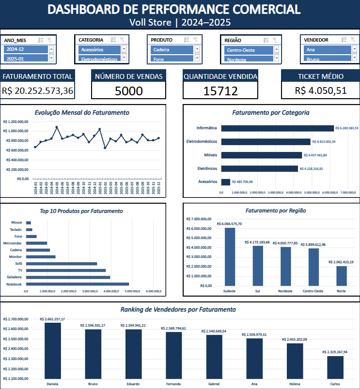

# 📊 Dashboard de Performance Comercial — Excel

## 📌 Sobre o projeto

Este projeto foi desenvolvido com o objetivo de analisar o desempenho comercial de uma empresa fictícia, utilizando o Microsoft Excel como ferramenta de análise e visualização de dados.

Foi desenvolvido um dashboard interativo para acompanhar indicadores de vendas e identificar padrões relacionados a faturamento, produtos, categorias, regiões e vendedores.

---

## 🎯 Objetivo

A análise busca responder às principais perguntas de negócio:

- Qual foi o faturamento total?
- Quantas vendas foram realizadas?
- Qual foi a quantidade de produtos vendidos?
- Qual foi o ticket médio?
- Qual categoria apresentou maior faturamento?
- Quais produtos geraram mais receita?
- Qual região apresentou melhor desempenho?
- Quais vendedores apresentaram maior faturamento?
- Como o faturamento se comportou ao longo dos meses?

---

## 🛠️ Ferramentas utilizadas

- Microsoft Excel
- Tabelas Dinâmicas
- Gráficos
- Segmentação de Dados
- Linha do Tempo
- KPIs
- Análise exploratória de dados

---

## 📊 Base de dados

A base utilizada contém registros de vendas de uma empresa fictícia, abrangendo o período de 2024 a 2025.

### Principais informações:

- ID da venda
- Data da venda
- Produto
- Categoria
- Vendedor
- Região
- Estado
- Quantidade vendida
- Faturamento

### Volume de dados

**5.000 registros de vendas**

---

## 📈 Dashboard

O dashboard foi desenvolvido para permitir uma análise interativa do desempenho comercial.

Os principais filtros disponíveis são:

- Produto
- Categoria
- Região
- Vendedor
- Período

### 📊 Visualizações

O dashboard apresenta as seguintes visualizações:

1. **Evolução mensal do faturamento** — permite acompanhar o comportamento das vendas ao longo do período.
2. **Faturamento por categoria** — permite comparar o desempenho das diferentes categorias de produtos.
3. **Top 10 produtos por faturamento** — apresenta os produtos que mais contribuíram para a receita.
4. **Faturamento por região** — permite identificar as regiões com maior e menor participação no faturamento.
5. **Ranking de vendedores por faturamento** — apresenta o desempenho dos vendedores e permite identificar os profissionais com maior contribuição para a receita.

---

---

## 📌 Principais KPIs

| Indicador | Resultado |
|---|---:|
| Faturamento Total | R$ 20.252.573,36 |
| Número de Vendas | 5.000 |
| Quantidade Vendida | 15.712 |
| Ticket Médio | R$ 4.050,51 |

---

## 🔎 Principais Insights

### 1. Desempenho por categoria

A categoria **Informática** apresenta o maior faturamento entre as categorias analisadas, com aproximadamente **R$ 6,20 milhões**.

A categoria **Acessórios** apresenta o menor faturamento, com aproximadamente **R$ 0,40 milhão**.

### 2. Desempenho por região

A região **Sudeste** apresenta o maior faturamento, com aproximadamente **R$ 6,07 milhões**.

A região **Norte** apresenta o menor faturamento, com aproximadamente **R$ 2,06 milhões**.

### 3. Desempenho por produto

O **Notebook** apresenta o maior faturamento entre os produtos analisados, destacando-se como um dos principais geradores de receita.

### 4. Desempenho dos vendedores

**Daniela** apresenta o maior faturamento entre os vendedores analisados, com aproximadamente **R$ 2,66 milhões**.

### 5. Evolução temporal

O faturamento apresenta **oscilações significativas ao longo do período analisado**, com ocorrência de picos e quedas, sem uma tendência contínua de crescimento ou queda.

---

## 💡 Recomendações de negócio

Com base nos insights encontrados, foram propostas as seguintes recomendações:

- Investigar os fatores responsáveis pelo desempenho da categoria Informática.
- Avaliar oportunidades de crescimento para categorias com menor faturamento.
- Investigar as estratégias comerciais utilizadas no Sudeste e avaliar sua aplicação em outras regiões.
- Analisar fatores relacionados ao menor desempenho da região Norte.
- Monitorar estoque e demanda dos produtos de maior faturamento.
- Identificar boas práticas dos vendedores de melhor desempenho.
- Investigar possíveis efeitos de sazonalidade e campanhas comerciais sobre as oscilações mensais.

---

## 📚 Processo de análise

O projeto foi desenvolvido seguindo as seguintes etapas:

Base de dados
      ↓
Preparação dos dados
      ↓
Análise exploratória
      ↓
Tabelas Dinâmicas
      ↓
KPIs
      ↓
Dashboard interativo
      ↓
Identificação de Insights
      ↓
Recomendações de negócio
